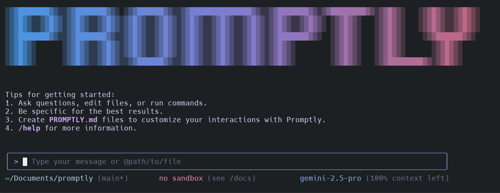

# Promptly

**Note: This is a modified version of the original Gemini CLI by Google LLC. The project has been renamed to "Promptly". Original copyright belongs to Google LLC under the Apache License 2.0.**

**Installation:** `npm install -g @lukaloehr/promptly` - Everything is included in this single package.

[](https://github.com/lukaloehr/promptly/actions/workflows/ci.yml)



Promptly is your intelligent command-line companion that supercharges your development workflow. Built on the foundation of Google's Gemini CLI, Promptly brings AI-powered assistance directly to your terminal, helping you navigate codebases, automate tasks, and accelerate development with unprecedented ease.

## What makes Promptly special?

- **Contextual Code Intelligence**: Navigate and modify massive codebases that exceed traditional AI context limits through intelligent file analysis and memory management
- **Visual Understanding**: Transform sketches, diagrams, and PDFs into functional applications using advanced multimodal AI capabilities  
- **Workflow Automation**: Streamline complex development tasks from PR management to automated refactoring with simple natural language commands
- **Extensible Architecture**: Connect your favorite tools and services through MCP (Model Context Protocol) servers for unlimited possibilities
- **Real-time Information**: Access current information through integrated Google Search, keeping your AI assistant up-to-date with the latest documentation and best practices

## Getting Started

Promptly offers flexible installation options to match your workflow.

### Node.js Installation

1. **Requirements:** [Node.js v20+](https://nodejs.org/en/download) must be installed on your system
2. **Quick Start:** Launch Promptly instantly with:

   ```bash
   npx @lukaloehr/promptly
   ```

   For permanent installation:

   ```bash
   npm install -g @lukaloehr/promptly
   ```
   
   **Note:** Promptly is distributed as a single package. Everything you need is included in `@lukaloehr/promptly`.

   Then use Promptly from any directory:

   ```bash
   promptly
   ```

### Homebrew Installation (Coming Soon)

1. **Requirements:** [Homebrew](https://brew.sh/) package manager
2. **Installation:** Run this command:

   ```bash
   brew install promptly
   ```

   Launch Promptly from anywhere:

   ```bash
   promptly
   ```

### Initial Setup

3. **Choose Your Theme:** Select from various color schemes to match your terminal style
4. **Authentication:** Sign in with your Google account for generous free tier access:
   - 60 requests per minute
   - 1,000 requests per day

You're all set to experience the power of Promptly!

### Using a Gemini API Key

For more control and higher limits, use your own Gemini API key. The free tier includes [100 daily requests](https://ai.google.dev/gemini-api/docs/rate-limits#free-tier) with Gemini 2.5 Pro:

1. Generate a key from [Google AI Studio](https://aistudio.google.com/apikey).
2. Set it as an environment variable in your terminal. Replace `YOUR_API_KEY` with your generated key.

   ```bash
   export GEMINI_API_KEY="YOUR_API_KEY"
   ```

3. (Optionally) Upgrade your Gemini API project to a paid plan on the API key page (will automatically unlock [Tier 1 rate limits](https://ai.google.dev/gemini-api/docs/rate-limits#tier-1))

### Enterprise Setup with Vertex AI

For organizations and power users, Vertex AI offers enterprise-grade features with a [free tier](https://cloud.google.com/vertex-ai/generative-ai/docs/start/express-mode/overview) to get started:

1. Generate a key from [Google Cloud](https://cloud.google.com/vertex-ai/generative-ai/docs/start/api-keys).
2. Set it as an environment variable in your terminal. Replace `YOUR_API_KEY` with your generated key and set GOOGLE_GENAI_USE_VERTEXAI to true

   ```bash
   export GOOGLE_API_KEY="YOUR_API_KEY"
   export GOOGLE_GENAI_USE_VERTEXAI=true
   ```

3. (Optionally) Add a billing account on your project to get access to [higher usage limits](https://cloud.google.com/vertex-ai/generative-ai/docs/quotas)

Explore additional authentication options, including Google Workspace integration, in our [authentication guide](./docs/cli/authentication.md).

## Real-World Examples

Promptly transforms how you interact with your development environment. Here's what you can achieve:

### Starting Fresh Projects

```sh
cd new-project/
promptly
> Write me a Discord bot that answers questions using a FAQ.md file I will provide
```

### Working with Existing Codebases

```sh
git clone https://github.com/lukaloehr/promptly
cd promptly
promptly
> Give me a summary of all of the changes that went in yesterday
```

### Continue Your Journey

- 🛠️ [Build and Contribute](./CONTRIBUTING.md) - Join the Promptly community
- 📚 [Command Reference](./docs/cli/commands.md) - Master all available commands
- 🔧 [Troubleshooting](./docs/troubleshooting.md) - Quick solutions to common issues
- 📖 [Complete Documentation](./docs/index.md) - Deep dive into all features
- 💡 [Popular Workflows](#popular-workflows) - Get inspired by real use cases
- 🗺️ [Development Roadmap](./ROADMAP.md) - See what's coming next

### Need Help?

Check our [troubleshooting guide](docs/troubleshooting.md) for quick solutions to common issues.

## Popular Workflows

### Codebase Exploration

Navigate to any repository and launch `promptly` to unlock powerful code analysis:

```text
> Describe the main pieces of this system's architecture.
```

```text
> What security mechanisms are in place?
```

```text
> Provide a step-by-step dev onboarding doc for developers new to the codebase.
```

```text
> Summarize this codebase and highlight the most interesting patterns or techniques I could learn from.
```

```text
> Identify potential areas for improvement or refactoring in this codebase, highlighting parts that appear fragile, complex, or hard to maintain.
```

```text
> Which parts of this codebase might be challenging to scale or debug?
```

```text
> Generate a README section for the [module name] module explaining what it does and how to use it.
```

```text
> What kind of error handling and logging strategies does the project use?
```

```text
> Which tools, libraries, and dependencies are used in this project?
```

### Development Acceleration

```text
> Implement a first draft for GitHub issue #123.
```

```text
> Help me migrate this codebase to the latest version of Java. Start with a plan.
```

### Workflow Automation

Connect Promptly to your tools through MCP servers for seamless automation:

```text
> Make me a slide deck showing the git history from the last 7 days, grouped by feature and team member.
```

```text
> Make a full-screen web app for a wall display to show our most interacted-with GitHub issues.
```

### System Utilities

```text
> Convert all the images in this directory to png, and rename them to use dates from the exif data.
```

```text
> Organize my PDF invoices by month of expenditure.
```

### Uninstalling Promptly

See our [uninstall guide](docs/Uninstall.md) for clean removal instructions.

## Legal Information

Review our [Terms of Service and Privacy Notice](./docs/tos-privacy.md) for complete legal details.

## Security

We take security seriously. Report vulnerabilities through our [security disclosure process](SECURITY.md). View all [security advisories](https://github.com/lukaloehr/promptly/security/advisories) on GitHub.